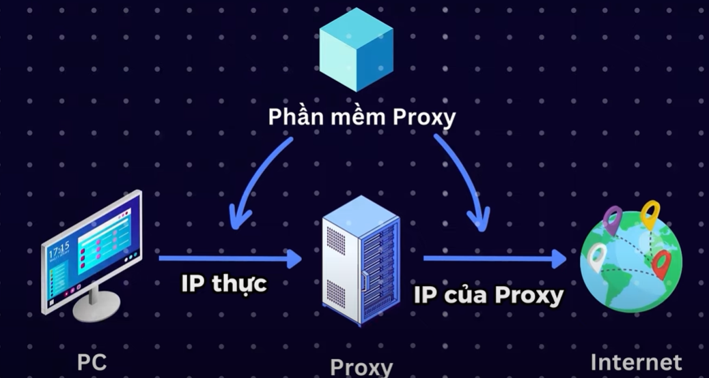

# Ẩn Danh

Ẩn danh là một điều thú vị bảo vệ, cho dù bên trong hay bên ngoài mạng máy tính.

Khi đi ăn trộm thì ai lại để mặt mộc rồi cầm theo CMND/CCCD để khai báo rằng mình đi ăn trộm đâu đúng không =))

Trong bài viết này, tôi sẽ sử dụng VPN, Tor và ProxyChains cùng nhau để ẩn danh an toàn
hơn.

1. VPN
    
    Đây là một loại phần mềm cho phép bạn kết nối với internet thông qua một đường hầm được mã hóa, nó ẩn địa chỉ IP của bạn và che giấu danh tính trực tuyến của bạn để tất cả các hành
    động trực tuyến của bạn bị ẩn.
    
2. Proxychains
    
    **Proxy là một máy chủ trung gian đóng vai trò cầu nối giữa máy tính của bạn và internet.**
    
    Proxy giúp che dấu IP thật của người dùng
    
    
    
    Và Proxychains là phần mềm giúp chúng ta che dấu IP thật của mình
    
3. Tor là gì?
    
    Tor là một phần mềm cho phép bạn ẩn danh tính của mình trên internet. Nó là một mạng mở
    giúp bảo vệ khỏi phân tích lưu lượng và cấp cho bạn mức độ riêng tư cao.
    

---

Bây giờ hãy chuẩn bị các công cụ sau

- Phần mềm [ProtonVPN](https://protonvpn.com/) cho window
- Proxychains
- Tor
- Kali Linux

Phần mềm để quan sát chúng ta có thành công hay không

[whatismyip](https://www.whatismyip.com/)

1. Điều chỉnh mạng của Kali trong VM thành NAT
    
    
    

1. kiểm tra IP Kali và windown khi chưa **Ẩn danh**
    
    windown
    
    
    
    Kali
    
    
    
2. Bật Proxychains và Tor
    
    Đầu tiên nếu Kali chưa có Proxychains và Tor thì dùng lệnh sau
    
    ```sql
    apt‐get install tor proxychains 
    ```
    
    Nếu đã có sẵn thì ta cấu hình cho Proxichains
    
    ```sql
    leafpad /etc/proxychains.conf
    ```
    
    Thay đổi các cài đặt như sau:
    
    ```sql
    #dynamic_chain -> dynamic_chain
    strict_chain   -> #strict_chain
    
    [ProxyList]
    # add proxy here ...
    # meanwile
    # defaults set to "tor"
    socks5 127.0.0.1 9050
    
    ```
    
    Và bật dịch vụ Tor lên
    
    ```sql
    service tor start
    ```
    
    Kiểm tra dịch vụ đã bật hay chưa
    
    ```sql
    service tor status
    ```
    
    Giờ hãy kiểm tra xem proxy có hoạt động hay không
    
    ```sql
    proxychains firefox www.dnsleaktest.com
    ```
    
    
    
    